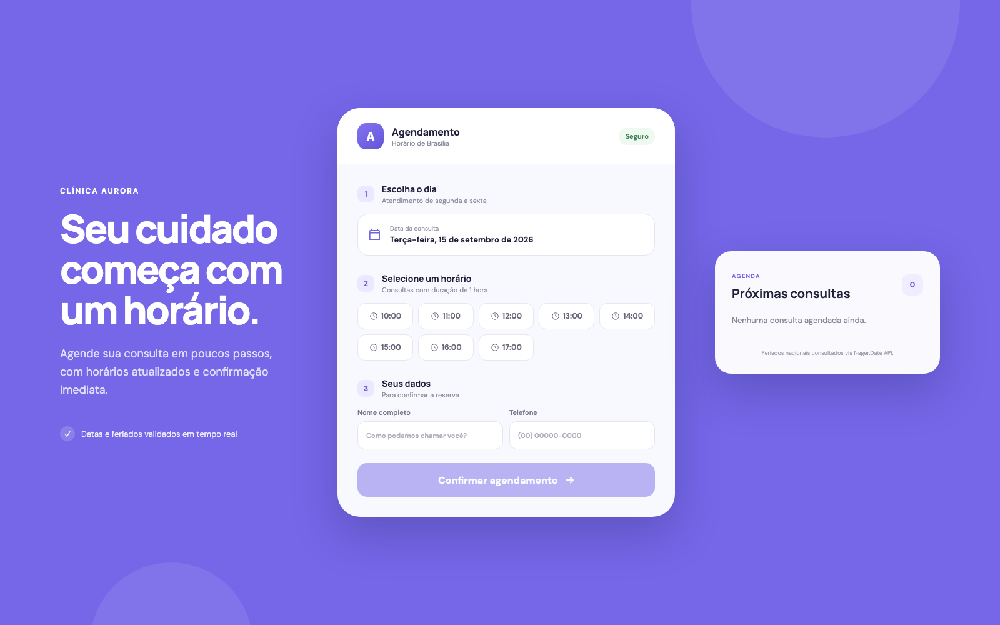
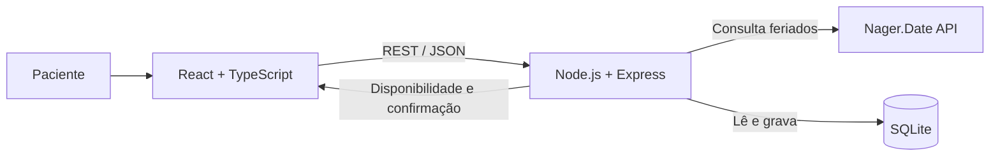

<div align="center">

# Clínica Aurora

### Agendamento de consultas, simples para o paciente e seguro para a clínica.

[](https://react.dev/)
[](https://www.typescriptlang.org/)
[](https://nodejs.org/)
[](https://www.sqlite.org/)

Sistema Full Stack para consultar horários disponíveis, validar dias úteis e confirmar agendamentos em tempo real.

</div>



## Sobre o projeto

A **Clínica Aurora** transforma um processo manual de atendimento por WhatsApp em um fluxo digital de poucos passos. O paciente escolhe uma data, consulta a disponibilidade real, informa seus dados e recebe uma confirmação com protocolo.

O backend é a fonte de verdade: consulta os feriados nacionais, aplica as regras da clínica e impede que dois pacientes reservem o mesmo horário.

## Principais funcionalidades

| Funcionalidade | Como funciona |
| --- | --- |
| Consulta de disponibilidade | Exibe somente horários livres entre 08:00 e 18:00 |
| Validação de calendário | Bloqueia finais de semana e feriados nacionais de 2026 |
| Agendamento persistente | Salva as consultas em um banco SQLite |
| Proteção contra conflitos | Valida no backend e aplica uma restrição única no banco |
| Contexto local | Usa data e horário de `America/Sao_Paulo` |
| Confirmação completa | Retorna protocolo, paciente, data, horário e fuso |
| Agenda resumida | Mostra as próximas consultas em ordem cronológica |
| Interface responsiva | Funciona em celulares, tablets e desktops |

## Arquitetura



### Fluxo do agendamento

```text
Escolher data
    ↓
Consultar o backend
    ↓
Validar ano, fim de semana e feriado
    ↓
Remover horários passados e ocupados
    ↓
Selecionar horário e informar os dados
    ↓
Salvar no SQLite e retornar a confirmação
```

## Regras de negócio

- atendimento de segunda a sexta-feira;
- horário de funcionamento das **08:00 às 18:00**;
- consultas com duração de **1 hora**;
- último horário disponível às **17:00**;
- bloqueio de feriados nacionais e finais de semana;
- bloqueio de horários passados quando a data selecionada é hoje;
- impossibilidade de criar dois agendamentos na mesma data e horário;
- calendário do desafio limitado ao ano de **2026**.

## Tecnologias

### Frontend

- React 19;
- TypeScript;
- Vite;
- CSS responsivo sem framework visual.

### Backend

- Node.js 22+;
- Express 5;
- SQLite nativo do Node.js;
- API pública [Nager.Date](https://date.nager.at/) para feriados brasileiros;
- Node Test Runner para testes automatizados.

## Como executar

### Pré-requisitos

- Node.js 22 ou superior;
- npm.

### Desenvolvimento

```bash
git clone https://github.com/LeoNardoRR/agenda-clinica-fullstack.git
cd agenda-clinica-fullstack
npm install
npm run dev
```

Abra o frontend em [http://localhost:5173](http://localhost:5173). A API será executada em `http://localhost:3333`.

### Produção local

```bash
npm run build
npm start
```

Depois, abra [http://localhost:3333](http://localhost:3333).

> O `index.html` não deve ser aberto diretamente pelo protocolo `file://`. A aplicação precisa ser servida pelo Vite ou pelo servidor Node.js.

## API REST

Todas as rotas funcionam com ou sem o prefixo `/api`.

### Consultar horários

```http
GET /available?date=2026-10-20
```

Resposta:

```json
{
  "date": "2026-10-20",
  "available": ["08:00", "09:00", "10:00", "11:00"],
  "blockedReason": null
}
```

### Criar agendamento

```http
POST /appointments
Content-Type: application/json
```

```json
{
  "patientName": "Maria Silva",
  "phone": "11999999999",
  "date": "2026-10-20",
  "time": "10:00"
}
```

### Listar agendamentos

```http
GET /appointments
```

### Verificar a API

```http
GET /api/health
```

## Scripts disponíveis

| Comando | Finalidade |
| --- | --- |
| `npm run dev` | Executa frontend e backend com recarregamento automático |
| `npm run dev:web` | Executa somente o frontend |
| `npm run dev:server` | Executa somente o backend |
| `npm run test` | Executa os testes automatizados |
| `npm run build` | Valida o TypeScript e gera o frontend de produção |
| `npm start` | Serve a API e o frontend compilado |
| `npm run check` | Executa testes e build em uma única verificação |

## Estrutura do projeto

```text
agenda-clinica-fullstack/
├── docs/                  # Imagens da documentação
├── server/
│   ├── app.js             # Rotas e validações REST
│   ├── database.js        # Persistência SQLite
│   ├── holidays.js        # Integração com a Nager.Date
│   ├── index.js           # Inicialização do servidor
│   └── scheduling.js      # Regras de datas e horários
├── src/
│   ├── App.tsx            # Fluxo principal da interface
│   ├── main.tsx           # Entrada do React
│   └── styles.css         # Design responsivo
├── test/                  # Testes da API e regras de negócio
└── README.md
```

## Qualidade e validação

O projeto inclui testes para:

- geração dos horários de funcionamento;
- validação de datas e finais de semana;
- remoção de horários passados e ocupados;
- consulta, criação e listagem pela API REST;
- bloqueio de agendamentos duplicados;
- bloqueio de feriados.

Execute toda a validação automatizada com:

```bash
npm run check
```

---

<div align="center">

Desenvolvido como solução para um desafio técnico Full Stack.

</div>
